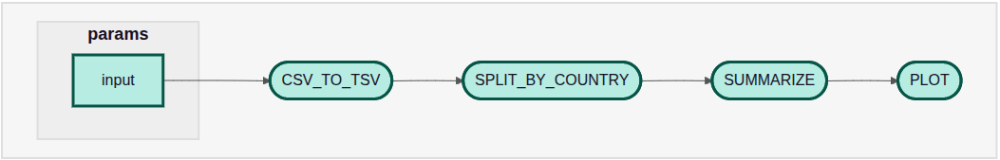

<!--

author:   Kobe Lavaerts, Tuur Muyldermans, Kris Davie, Steff Taelman
email:    training@vib.de
version:  1.0.0
language: en
narrator: UK English Female

icon:     https://vib.be/sites/vib.sites.vib.be/files/logo_VIB_noTagline.svg

comment:  This document shall provide an entire compendium and course on the
          development of Open-courSes with [LiaScript](https://LiaScript.github.io).
          As the language and the systems grows, also this document will be updated.
          Feel free to fork or copy it, translations are very welcome...

script:   https://cdn.jsdelivr.net/chartist.js/latest/chartist.min.js
          https://felixhao28.github.io/JSCPP/dist/JSCPP.es5.min.js

link:     https://cdn.jsdelivr.net/chartist.js/latest/chartist.min.css
link:     https://cdnjs.cloudflare.com/ajax/libs/animate.css/4.1.1/animate.min.css
link:     https://raw.githubusercontent.com/vibbits/material-liascript/master/img/org.css
link:     https://cdnjs.cloudflare.com/ajax/libs/font-awesome/5.11.2/css/all.min.css
link:     https://fonts.googleapis.com/css2?family=Saira+Condensed:wght@300&display=swap
link:     https://fonts.googleapis.com/css2?family=Open+Sans&display=swap
link:     https://raw.githubusercontent.com/vibbits/material-liascript/master/vib-styles.css
link: https://cdn.jsdelivr.net/npm/marked-admonition-extension@0.0.4/dist/index.min.css
mode: Presentation

@style
.admonition {
    font-size: initial !important;
}
@end

@JSONLD
<script run-once>
  let json = @0

  const script = document.createElement('script');
  script.type = 'application/ld+json';
  script.text = JSON.stringify(json);

  document.head.appendChild(script);

  // this is only needed to prevent and output,
  // as long as the result of a script is undefined,
  // it is not shown or rendered within LiaScript
  console.debug("added json to head")
</script>
@end

orcid:    [@0](@1)<!--class="orcid-logo-for-author-list"-->

tutor:    Introduction to Nextflow
edition:  6th

-->

# Nextflow workshop

<section>

Hello and welcome to our @tutor workshop! We are very happy to have you here. This repository contains the data, scripts, documentation and relevant information for the website containing the training materials.

This is the @edition edition of this workshop, jointly organised by VIB and ELIXIR.


Let's start!

> We are using the interactive Open Educational Resource online/offline course infrastructure called LiaScript.
> It is a distributed way of creating and sharing educational content hosted on github.
> To see this document as an interactive LiaScript rendered version, click on the
> following link/badge: [LiaScript](https://liascript.github.io/course/?https://raw.githubusercontent.com/vibbits/nextflow-workshop/main/README.md)

## General context

This repository contains the materials (exercises) for the workshop on Nextflow on 28-29th April 2025.

The **presentations** which goes alongside this material can be found [in the Lesson overview: Slides](#2) .

## Proposed Schedule

Schedule day 1:

- 9:30 - 10:30 - Introduction to Nextflow: Building Blocks
- 10:30 - 10:45 - Break
- 10:45 - 12:00 - Exercises
- 12:00 - 13:00 - lunch
- 13:00 - 14:45 - Processes and Workflows
- 14:45 - 15:00 - break
- 15:00 - 17:30 - Creating our first pipeline

Schedule day 2:

- 9:30 - 10:45 - Modules
- 10:45 - 11:00 - break
- 11:00 - 12:30 - Exercises, Config files, Reports
- 12:30 - 13:30 - lunch
- 13:30 - 15:00 - Project Challenge
- 15:00 - 15:15 - break
- 15:30 - 17:00 - Project Challenge

</section>

```json   @JSONLD
{
  "@context": "https://schema.org/",
  "@type": "LearningResource",
  "@id": "https://elixir-europe-training.github.io/ELIXIR-TrP-TeSS/",
  "http://purl.org/dc/terms/conformsTo": {
    "@type": "CreativeWork",
    "@id": "https://bioschemas.org/profiles/TrainingMaterial/1.0-RELEASE"
  },
  "description": "Introduction to Docker and Apptainer",
  "keywords": "Docker, Containers, Recipes, Singularity",
  "name": "Introduction to Docker and Apptainer",
  "license": "https://creativecommons.org/licenses/by/4.0/",
  "educationalLevel": "beginner",
  "competencyRequired": "none",
  "teaches": [
    "Define what containers are and articulate the differences between Docker and Singularity.",
   "Identify the components of a Docker recipe and correlate with the layers within a Docker image.",
   "List the benefits of containerization, considering reproducibility, usage and installation.",
   "Recognize the use cases where Docker is the preferred method for deploying applications.",
    "Discuss case studies to justify the selection of Docker or Singularity for specific deployment scenarios."
  ],
  "audience": "researchers",
  "inLanguage": "en-US",
  "learningResourceType": [
    "tutorial"
  ],
  "author": [
    {
      "@type": "Person",
      "name": "Bruna Piereck"
    },
    {
      "@type": "Person",
      "name": "Alexander Botzki"
    }
  ],
  "contributor": [
    {
      "@type": "Person",
      "name": "Christof De Bo"
    }
  ]
}
```

## Lesson overview

> <i class="fa fa-lock"></i> **License:** [Creative Commons Attribution 4.0 International  License](https://creativecommons.org/licenses/by/4.0/deed.en)
>
> <i class="fa fa-user"></i> **Target Audience:** Researchers
>
> <svg xmlns="http://www.w3.org/2000/svg" height="14" width="16" viewBox="0 0 576 512"><!--!Font Awesome Free 6.5.1 by @fontawesome - https://fontawesome.com License - https://fontawesome.com/license/free Copyright 2023 Fonticons, Inc.--><path d="M384 64c0-17.7 14.3-32 32-32H544c17.7 0 32 14.3 32 32s-14.3 32-32 32H448v96c0 17.7-14.3 32-32 32H320v96c0 17.7-14.3 32-32 32H192v96c0 17.7-14.3 32-32 32H32c-17.7 0-32-14.3-32-32s14.3-32 32-32h96V320c0-17.7 14.3-32 32-32h96V192c0-17.7 14.3-32 32-32h96V64z"/></svg> **Level:** Beginner
>
> <i class="fa fa-arrow-left"></i> **Prerequisites**
> To be able to follow this course, learners should have knowledge in:
>
> 1. Knowledge of Command line Interface is a plus
>
> <i class="fa fa-bookmark"></i> **Description** This course aims to get you familiarized with Nextflow. After this course you should be able to understand workflow pipelines that are written in Nextflow and write simple pipelines yourself.
>
> <i class="fa fa-arrow-right"></i> **Learning Outcomes:**
> By the end of the course, learners will be able to:
>
> 1. Understand Nextflow's basic concepts & syntax: channels, processes, modules, workflows, etc.
> 2. Execute local and publicly available pipelines with different executors and environments
> 3. Write and run Nextflow pipelines
> 4. Write and modify config files for storing parameters related to computing hardware as well as pipeline dependent parameters
>
>> Check more about [Bloom's taxonomy](https://cft.vanderbilt.edu/guides-sub-pages/blooms-taxonomy/) to categorize the levels in educational goals
>
> <i class="fa fa-hourglass"></i> **Time estimation**: 16 hours
>
> <i class="fa fa-asterisk"></i> **Requirements:** The (technical) installation requirements are described in the Chapters overview section Getting ready.
>
> <i class="fa fa-envelope-open-text"></i> **Supporting Materials**:
>
> 1. [Exercises and solutions](https://github.com/vibbits/nextflow-workshop)
> 2. [Slides day 1+2](https://docs.google.com/presentation/d/1sv79FpO-kN8BO271SG5oDHrVJBEdJGnh0_TG8qzDyGI/edit?usp=sharing)
>
> <i class="fa fa-life-ring"></i> **Acknowledgement**:
>
> * [ELIXIR Belgium](https://www.elixir-belgium.org/)
> * [VIB Technologies](https://www.vib.be/)
> * [UZ Ghent](https://www.uzgent.be/)
>
> <i class="fa fa-money-bill"></i> **Funding:** This project has received funding from VIB and ELIXIR Belgium.
>
> <i class="fa fa-anchor"></i> **PURL**:


## Authors and Contributors

Authors

- @[orcid(Bruna Piereck)](https://orcid.org/0000-0001-5958-0669)
- @[orcid(Alexander Botzki)](https://orcid.org/0000-0001-6691-4233)
- @[orcid(Tuur Muyldermans)](https://orcid.org/0000-0002-3926-7293)
- @[orcid(Kris Davie)](https://orcid.org/0000-0003-2182-1249)
- @[orcid(Kobe Lavaerts)](https://orcid.org/0000-0003-0490-5969)
- @[orcid(Tuur Muyldermans)](https://orcid.org/0000-0002-3926-7293)
- @[orcid(Steff Taelman)](https://orcid.org/0000-0002-2685-4130)
- @[orcid(Nicolas Vannieuwkerke)](https://orcid.org/0009-0003-5619-1555)

Contributors

- we welcome contributors for these materials


## Chapters List

| Chapter | Title                                                   |
| :---- | :------------------------------------------------         |
| 0     | [Getting Ready](#get-ready-for-the-course)  |
| 1     | [Building blocks](#building-blocks)  |
| 2     | [Executing pipelines](#executing-pipelines)  |
| 3     | [Creating first pipeline](#creating-our-first-pipeline)  |
| 4     | [Configuration files](#configuration-files)  |
| 5     | [Creating reports](#creating-reports)  |
| 6     | [Project](#project)  |

## Get ready for the course

Please read this page carefully **before** the start of the workshop.

There are two options for following this workshop:

  1. do the installations yourself & be in control of everything,
  2. use the setup that we have provided with the installations already done.

In the former case, you will have to download [Nextflow](https://www.nextflow.io/docs/stable/getstarted.html) and [Apptainer](https://apptainer.org/). In the latter case, you can follow the instructions below.

### Provided infrastructure

We will be using the Gent section of the [Flemish Supercomputing Center](https://www.vscentrum.be/), you should have already recieved instructions for creating an account. Specifically, we will be using the [Interactive and Debug](https://docs.hpc.ugent.be/Linux/interactive_debug/) cluster. The cluster is already equipped with the latest version of Nextflow, and Apptainer.

To connect to the cluster, there are two options. For the first option, there is no local setup needed, we will use the Web Interface to access the Gent VSC.

#### Option 1: Web Interface

This utilizes the OnDemand infrastructure at the VSC to launch a web-based version of VSCode for us. Using this, we don't need to make any connections to the clutser other than through the browser.

_If you normally use VSCode locally, this setup is completely seperate and won't have your usual extensions etc._

- Navigate to [https://login.hpc.ugent.be/](https://login.hpc.ugent.be/) and login with your credentials.
- Select "Interactive Apps" from the top bar -> "Code Server"
- Fill in the following settings:

  - Cluster: `donphan (interactive/debug)`
  - Time: 12 (hours)
  - Nodes: 1
  - Cores: 8
  - Select Path -> /data/... (on the left)
  - Click "Launch"!
- Wait for your job to start -> "Connect to VS Code"

This runs fully in your browser and will continue to run even when your laptop is off etc. Your job will automatically end after 12 hours. **Make sure to save your work.**

#### Option 2: Local Installation

We will be using an SSH connection in VSCode which we can create by following these instructions:

- Download Visual Studio Code ([link](https://code.visualstudio.com/download))
- Add the following extensions for a seamless integration of Nextflow and the VM in VScode:

  - In VSCode, navigate to the 'Extensions' tab, search for the SSH remote package and install it:
  - 'Remote - SSH' (ms-vscode-remote.remote-ssh).
- Modify your local `.ssh/config` file to add the configuration for the cluster - If you already connect to the Gent VSC with this machine, you don't need to do this

  - `Ctrl-Shift-P` will bring up the "command palette"
  - Type `ssh config` and select the option to modify the configuration file (select the first file)
  - Add the following code to your config file:
```
Host login-gent
    User vscXXXXX # Replace Xs with your VSC ID
    HostName login.hpc.ugent.be
    IdentityFile ~/.ssh/id_rsa # This should be replaced with the path to your private key ( windows users might look like this: C:\Users\KrisDavie\Documents\VSC\vsc_id_rsa)

```
- Start a terminal in VSCode (select Terminal and then New Terminal)
- Connect to the cluster with the following command: `ssh login-gent`
- Optional: Start `screen` or `tmux` and do the following in the new terminal - This will keep your session alive even when you disconnect from the cluster
- Load the modules for connecting to the interactive cluster: `module swap cluster/donphan`
- Start a job using qsub: `qsub -I -l walltime=08:00:00,nodes=1:ppn=8`
- Note the node you are connected to (e.g. `node4006.donphan.os`)
- Add the following code to your config file:
```
Host node4006
    User vscXXXXX # Replace Xs with your VSC ID
    HostName node4006.donphan.os
    ProxyCommand ssh login-gent -W %h:%p
    # On windows you should use
    # ProxyCommand C:\Windows\System32\OpenSSH\ssh.exe login-gent -W %h:%p
    IdentityFile ~/.ssh/id_rsa # This should be replaced with the path to your private key ( windows users might look like this: C:\Users\KrisDavie\Documents\VSC\vsc_id_rsa)

```
- Finally you can open a this host in VSCode by typing `Ctrl-Shift-P` and selecting `Remote-SSH: Connect to Host...` and selecting the host you just added.

  - If you didn't run qsub in a screen or tmux session, you will need to use an entire new VSCode window to connect to the host, otherwise when VSCode refreshes, the original connection will be lost and the job will end.

#### Option 3: Custom Installation

You are free to connect to the cluster however you want, but the above 2 methods are the only ones we will support in the session.

### Common Setup

- Install the Nextflow VSCcode Extension - This will give you syntax highlighting and linting for Nextflow

  1. Go to extensions (CTRL+SHIFT+X)
  2. Search for "Nextflow"
  3. Install the Nextflow extension
  4. Click on the cogwheel ("Manage") and open the "Extension Settings"
  5. Scroll down to the `Nextflow > Java: Home` section and click on "Edit in settings.json"
  6. Change the `nextflow.java.home` setting to `"/apps/gent/RHEL8/cascadelake-ib/software/Java/21.0.2"`
  7. Open the command prompt (CTRL+SHIFT+P) and type `Nextflow: Restart language server` and press enter

- Open a new terminal within VSCode: Terminal -> New Terminal
- Create a new folder for the workshop
- Clone this repository into the folder: `git clone https://github.com/vibbits/nextflow-workshop.git`
- For the Gent cluster usage, in any terminal where you want to run your excercises 

  1. Load the nextflow module: `module load Nextflow/24.10.2`
  2. Export the following envrionment variables - these are required so that your home folder is not filled when building and storing apptainer images
   - `export APPTAINER_CACHEDIR=${VSC_SCRATCH}/.apptainer_cache`
   - `export APPTAINER_TMPDIR=${VSC_SCRATCH}/.apptainer_tmp`
  3. If these tmp folders don't exist yet in your scratch folder, you will have to create them first
   - `mkdir ${VSC_SCRATCH}/.apptainer_cache`
   - `mkdir ${VSC_SCRATCH}/.apptainer_tmp`

## Citing this lesson

Please cite as:

  1. Kobe Lavaerts, Tuur Muldermans, Kris Davies, Bruna Piereck, Kobe, Alexander Botzki. (2023). VIB Nextflow course (v2.0.0). Zenodo. tbc
  2. Geert van Geest, Elin Kronander, Jose Alejandro Romero Herrera, Nadja Žlender, & Alexia Cardona. (2023). The ELIXIR Training Lesson Template - Developing Training Together (v1.0.0-alpha). Zenodo. https://doi.org/10.5281/zenodo.7913092.

## References

Here are some great tips for learning and to get inspired for writing your own pipelines:

- Nextflow's official documentation ([link](https://www.nextflow.io/docs/latest/index.html))
- Reach out to the community on Slack ([link](https://www.nextflow.io/slack-invite.html))
- Curated collection of patterns ([link](https://github.com/nextflow-io/patterns))
- Workshop focused on DSL2 developed by CRG Bioinformatics Core ([link](https://github.com/biocorecrg/ELIXIR_containers_nextflow))
- Curated ready-to-use analysis pipelines by nf-core ([link](https://nf-co.re/))
- Model example pipeline on Variant Calling Analysis with NGS RNA-Seq data developed by CRG ([link](https://github.com/CRG-CNAG/CalliNGS-NF))
- Tutorial by Andrew Severin ([link](https://bioinformaticsworkbook.org/dataAnalysis/nextflow/02_creatingAworkflow.html#gsc.tab=0))
- Nextflow community fundamentals training ([link](https://training.nextflow.io/basic_training/))

--------------------------------------------

*About ELIXIR Training Platform*

The ELIXIR Training Platform was established to develop a training community that spans all ELIXIR member states (see the list of Training Coordinators). It aims to strengthen national training programmes, grow bioinformatics training capacity and competence across Europe, and empower researchers to use ELIXIR's services and tools.

One service offered by the Training Platform is TeSS, the training registry for the ELIXIR community. Together with ELIXIR France and ELIXIR Slovenia, VIB as lead node for ELIXIR Belgium is engaged in consolidating quality and impact of the TeSS training resources (2022-23) (https://elixir-europe.org/internal-projects/commissioned-services/2022-trp3).

The Training eSupport System was developed to help trainees, trainers and their institutions to have a one-stop shop where they can share and find information about training and events, including training material. This way we can create a catalogue that can be shared within the community. How it works is what we are going to find out in this course.

*About VIB and VIB Technologies*

VIB is an entrepreneurial non-profit research institute, with a clear focus on groundbreaking strategic basic research in life sciences and operates in close partnership with the five universities in Flanders – Ghent University, KU Leuven, University of Antwerp, Vrije Universiteit Brussel and Hasselt University.

As part of the VIB Technologies, the 12 VIB Core Facilities, provide support in a wide array of research fields and housing specialized scientific equipment for each discipline. Science and technology go hand in hand. New technologies advance science and often accelerate breakthroughs in scientific research. VIB has a visionary approach to science and technology, founded on its ability to identify and foster new innovations in life sciences.

The goal of VIB Technology Training is to up-skill life scientists to excel in the domains of VIB Technologies, Bioinformatics & AI, Software Development, and Research Data Management.

--------------------------------------------

*Editorial team for this course*

Authors: @[orcid(Alexander Botzki)](https://orcid.org/0000-0001-6691-4233), @[orcid(Bruna Piereck)](https://orcid.org/0000-0001-5958-0669)

Contributors: Finn Bacall, Aitor Apaolaza, Munazah Andrabi, Chris Child, Carole Goble, Olivier Sand

Technical Editors: Alexander Botzki

License: [](http://creativecommons.org/licenses/by/4.0/)


# Nextflow
This tutorial aims to get you familiarized with Nextflow. After this course you should be able to understand workflow pipelines that are written in Nextflow and write simple pipelines yourself! Here's an overview of the materials that we will cover:

- General introduction to Nextflow
- Building blocks of Nextflow: processes, channels and operators, workflows and modules
- Executing pipelines
- Creating our first Nextflow script(s)
- Managing configurations: parameters, portability, executors

The course materials are focused on the newer version of Nextflow DSL2. This is the newest version of the Nextflow language and the *de-facto* standard for writing new pipelines in Nextflow. In fact, DSL1 is supposed to be fading out and chances are that the support for DSL1 will be gone within a near future. Must you have any questions regarding pipelines written in DSL1, feel free to ask any questions during the workshop.


## Building blocks
In the first chapter we will elaborate on how Nextflow is designed, its advantages and disadvantages, the basic components, etc.

In the `data/` folder we have already installed some data for you to use in the following exercises.

### Introduction
Writing pipelines to automate processes is not something new, Bash scripts are probably one of the oldest forms of pipelines where we concatenate processes. Let's have a look at an example:

```bash
#!/bin/bash

cat data.tsv \
    | head -n 10 \
    | cut -d'\t' -f 2 \
    > third_column.tsv
```

Starting with a [shebang line](https://www.baeldung.com/linux/shebang-types), this script will take the first 10 lines of the `data.tsv` file, extract the third column and write it to a new file called `third_column.tsv`.

<details>

<summary>What is the downside of similar relatively simple pipelines?</summary>

There are a couple of suboptimal things happening here:

- Will it use the available resources optimally?
- Which versions of the tools are being used?
- Will it work on my machine (cfr. installation of tools)?
- Can we scale it to HPC clusters or Cloud environments?
- What if the pipeline fails somewhere in the middle, we need to restart the pipeline from the beginning?

</details>

---

In response to that, workflow managers such as Nextflow were built, aimed to deal with more complex situations. Nextflow is designed around the idea that Linux has many simple but powerful command-line and scripting tools that, when chained together, facilitate complex data manipulations.


By definition, Nextflow is a reactive workflow framework and a programming Domain Specific Language that eases the writing of data-intensive computational pipelines[[1](https://www.nextflow.io/)]. Nextflow scripting is an extension of the Groovy programming language, which in turn is a super-set of the Java programming language. Groovy can be considered as Python for Java in a way that simplifies the writing of code and is more approachable.


### Why (not)?
Nextflow is not the only player in the field[[2](https://github.com/pditommaso/awesome-pipeline/)], however there are good reasons to opt for it.

+ Parallelization: processes are automatically scheduled based on available resources
+ Scalability: simple scaling from local to HPC-cluster usage
+ Portability: run across different platforms
+ Reproducible: native support for containers, conda environments, and interaction with Git.
+ Re-usability: with the introduction of modules it becomes (theoretically) simple to re-use processes written in other pipelines
+ Community[[3](https://nf-co.re/)]: even though the community is never a reason why to choose for a tool (functionality is more important), it is still very relevant to know that when you are facing problems, there are people out there ready to help you out.

Some thoughts or disadvantages from my personal point of view. It takes some time to get used to the syntax of the Groovy language. As flexible as it is, as complex it gets. Often it's difficult to trace down the exact problem of a failure of a pipeline script, especially in the beginning. It's probably not the first thing you should be concerned of if you're doing a one-time analysis.


### Main abstractions
Nextflow consists of four main components: channels, operators, processes and workflows.

- *Processes*: **execute** a piece of code (script, command line tool, etc.) using the input from channels.
- *Channels*: **connect** processes using dataflows.
- *Operators*: **rearrange** the content of channels by applying functions or transformations.
- *Workflows*: **compose** the logic of the pipeline by combining processes, channels and operators.


The script [`exercises/01_building_blocks/firstscript.nf`](https://github.com/vibbits/nextflow-workshop/blob/main/exercises/01_building_blocks/firstscript.nf) is using these three components and gives an idea of how Nextflow scripts are being build.

```groovy
#!/usr/bin/env nextflow

// Defining the process that is executed
process valuesToFile {

    input:
    val nums
    val strs

    output:
    path 'result.txt'

    script:
    """
    echo $nums and $strs > result.txt
    """
}

// Running a workflow with the defined processes
workflow {
    // Creating a channel
    def numbers_ch = Channel.of(1,2,3)
    def strings_ch = Channel.of('a','b')

    valuesToFile(numbers_ch, strings_ch)
}
```

<div class="admonition admonition-info">
<p class="admonition-title">Parameters</p>

Besides these main building blocks, we also already highlight the existence of the `params` parameters. In the previous code block we explicitly defined some input values in the channels. However, we can define the input values into a parameter instead, that is passed on to the channel.

```groovy
// create a parameter 'input'
params.input = '/path/to/input.tsv'

// use the input parameter as an input for the channel
def input_ch = Channel.fromPath(params.input)
```
Here `params.input = '/path/to/input.tsv'` will create a parameter `input` and give it the value `'/path/to/input.tsv'` which is used as an input for the channel. We will later see that these parameters can then be overwritten on runtime.
</div>


#### 1. Channels
The input of the analysis is stored in a channel, these are generally files, however the input can be of any kind like numbers, strings, lists, etc. To have a complete overview, we refer to the official documentation\[[4](https://www.nextflow.io/docs/latest/channel.html#)\]. Here are some examples of how a channel can be created using channel factories:

```groovy
// Channel consisting of strings
def strings_ch = Channel.of('This', 'is', 'a', 'channel')

// Channel consisting of a single file
def file_ch = Channel.fromPath('data/file.txt')

// Channel consisting of multiple files by using a wildcard *
def multfiles_ch = Channel.fromPath('data/*.txt')
```

A full list of all channel factories can be found in the [documentation](https://www.nextflow.io/docs/latest/reference/channel.html#channel-factory).

These channels can then be used by operators or serve as an input for the processes.


##### Exercises

     {{0-2}}
****************

**Exercise 1.1**

**Reminder: Run all exercises from the root nextflow-workshop folder**

Inspect and edit the `exercises/01_building_blocks/template.nf` script. Create an additional channel containing all files with the `csv` extension located in the `data` directory and view the contents of the channel.

Once the Nextflow script is saved, run it with: `nextflow run exercises/01_building_blocks/template.nf`.


*************

          {{1-2}}
****************

**Solution 1.1**

The solution is available in the file `exercises/01_building_blocks/solutions/1.1_fromPath.nf`.

The expected output should look like this:

```
This
is
a
channel
.../nextflow-workshop/data/boardgames.csv
.../nextflow-workshop/data/crocodile_dataset.csv
```

*************


##### Channels vs Values

There are 2 distinct types of dataflows: channels and values.

- Dataflow values consist of a single value (i.e. a string or a number) and can be used within a process any number of times, the value is never consumed. 
- Dataflow channels consist of one or more elements which will be used once within a process, once an element is used, it cannot be used again within that process. 

  - A channel can be used as input to multiple processes. Each process will receive a copy of the channel and use its elements independently.
  - Channels are designed for connecting the output of one process to the input of other processes.

```groovy
# Values
def value1 = Channel.value(1)
def value2 = Channel.value("Hello World")
def value3 = Channel.value(["a", "b", "c"])

# Channels
def channel1 = Channel.of('This', 'is', 'a', 'channel')
def channel2 = Channel.fromPath('/path/to/files/*.txt')

```

<div class="admonition admonition-info">
<p class="admonition-title">Note</p>

In previous versions of Nextflow, channels were often reffered to as queue channels and values were often reffered to as value channels. This terminology is not used anymore in the official documentation, however you might still encounter it in older scripts or documentations.

</div>

More info about values and channels can be found in the [documentation](https://www.nextflow.io/docs/latest/channel.html#channel-types).

#### 2. Operators
Operators are necessary to transform the content of channels in a format that is necessary for usage in the processes. There are a plethora of different operators[[5](https://www.nextflow.io/docs/latest/operator.html?highlight=view#)], however only a handful are used extensively. Here are some examples that you might come accross:

- `collect`: **transforms** a dataflow channel to a dataflow value by concatenating all entries in the channel into one list. e.g. when using a channel consisting of multiple independent files that need to be assembled for a next process

<div class="admonition admonition-info">
<p class="admonition-title">Note</p>

The nextflow documentation details whether each operator produces a dataflow channel or value.

</div>


  Example: [`exercises/01_building_blocks/operator_collect.nf`](https://github.com/vibbits/nextflow-workshop/blob/main/exercises/01_building_blocks/operator_collect.nf)

```groovy
Channel
    .of( 1, 2, 3, 4 )
    .collect()
    .view()

// outputs
[1,2,3,4]
```

- `mix`: **combines** multiple dataflow channels into one channel by interleaving their elements.

  Example: [`exercises/01_building_blocks/operator_mix.nf`](https://github.com/vibbits/nextflow-workshop/blob/main/exercises/01_building_blocks/operator_mix.nf)

```groovy
def c1 = Channel.of( 1,2,3 )
def c2 = Channel.of( 'a','b' )
def c3 = Channel.of( 'z' )

c1 .mix(c2,c3)
   .view()

// possible output
a
1
2
b
3
z
```

- `map`: **transforms** a dataflow channel or value by applying a function to each item in the channel or value.

  - The map operator is expressed as a [closure](https://www.nextflow.io/docs/latest/script.html#script-closure) (`{ ... }`)
  - By default, the items in the channel are referenced by the variable `it`. This can be changed by using the `map { item -> ... }` syntax, which is considered a best practice in the field.

  Example: [`exercises/01_building_blocks/operator_map.nf`](https://github.com/vibbits/nextflow-workshop/blob/main/exercises/01_building_blocks/operator_map.nf)

```groovy
Channel
    .of( 1, 2, 3, 4, 5 )
    .map { number -> number * number }
    .view()

// outputs
1
4
9
16
25
```

##### Exercises

    {{0-2}}
****************

**Exercise 1.2**

Create a channel from a csv-file (`input.csv`) and use an operator to view the contents. Generate the channel for the `input.csv`-file which you can find in the `exercises/01_building_blocks/` folder and is a subset of the `boardgames.csv` file located in the `data/` folder. The file looks like this:

<!-- data-type="none" -->
| boardgame | release_year |
|-----------|---------------|
| Brass: Birmingham | 2018 |
| Pandemic Legacy: Season 1 | 2015 |
| Ark Nova | 2021 |
| Gloomhaven | 2017 |
| Twilight Imperium: Fourth Edition | 2017 |

Test your Nextflow script with: `nextflow run <name>.nf`.

*************

    {{1-2}}
****************

**Solution 1.2**

The solution is available in the file `exercises/01_building_blocks/solutions/1.2_template-csv.nf`

The file is imported with `.fromPath()`, followed by the `splitCsv()` operator where we set the header to `True`. The last step will output how the channels are constructed. Each row is transformed into a tuple with the first element as a variable `boardgame` and the second element as `release_year`.

```groovy
def samples_ch = Channel
                .fromPath('exercises/01_building_blocks/input.csv')  // make sure that the path towards the file is correct
                .splitCsv(header:true)

```
**********

    {{2}}
****************

**Exercise 1.3**

Building on exercise 1.2 and using the `map` operator, create 2 channels, one containing the name of the boardgame and the second containing the release year. Use the `view` operator to inspect the contents of these channels.

********

    {{3}}
****************

**Solution 1.3**

The solution is available in the file `exercises/01_building_blocks/solutions/1.3_template-csv-map.nf`

**************


#### 3. Processes
Processes are the backbone of the pipeline. They represent each individual subpart of the analysis. In the code-snippet below, you can see that it consists of a couple of blocks: `directives`, `input`, `output` and the `script` itself.

```groovy
process < name > {

   [ directives ]

   input:
    < process inputs >

   output:
    < process outputs >

   script:
   < user script to be executed >
}
```

Here is an example of a process:


> **Writing a file**
>
> Creating an output file `results.txt` with inputs from channels `nums` and `strs`
>
> ```groovy
> process valuesToFile {
>     input:
>     val nums
>     val strs
>
>     output:
>     path 'result.txt', emit: results
>
>     script:
>     """
>     echo $nums and $strs > result.txt
>     """
> }
> ```

---

##### Inputs

The **input** declaration block defines the structure of the dataflows the process expects to receive. Each input starts with an input qualifier followed by the input name. The most frequently used qualifiers are:

- `val`: represents a single value (e.g. numbers or strings)
- `path`: declares that a file object is expected here. This should always be used when a file is expected as input.
- `tuple`: a combination of input values having one of the available qualifiers (e.g. tuple containing a value and two files).

This example shows the input block of a process expecting two inputs. The first input should be a tuple consisting of an identifier and a filename. The second input is a single value representing the number of threads to be used.

```groovy
input:
    tuple val(id), path(fq)
    val threads
```

To see a full list of input qualifiers, please refer to the [documentation](https://www.nextflow.io/docs/latest/process.html#inputs).

##### Outputs

The **output** declaration block defines the structure of the dataflows that need to be created from the results of the analysis. They are very similar to the input declarations, using a qualifier (e.g. `val`, `path` and `tuple`) followed by the name of generated output. The output of a process usually serves as the input of another process.

The `emit` option can be used to assign a name to the output so it can be referenced in the workflow code in a clear way. In the following example we can access the results using the following notation: `valuesToFile.out.results`.

```groovy
process valuesToFile {

    ...

    output:
    path 'result.txt', emit: results

    ...

}
```

<div class="admonition admonition-info">
<p class="admonition-title">Note</p>

By default, the output of a process is a dataflow channel, however, when all of the input channels into a process are dataflow values, the output will automaticaly also be a value.

</div>

##### Directives

**Directives** are optional settings that affect the process execution, and are defined at the top of the process. They can be any of the [following long list of possibilities](https://www.nextflow.io/docs/latest/reference/process.html#directives). These are some of the most commonly used directives:

- `publishDir`: define how the data should be stored in the output directory
- `container`: define the container that should be used for the process
- `cpus`: define the number of CPUs that should be used for the process
- `memory`: define the amount of memory that should be used for the process
- `time`: define the maximum runtime for the process

We will discover some of the possibilities further in the course.

##### Execution

The **script** block contains the actual code that will be executed. This can be any code that can be executed in a bash shell, e.g. bash commands, Python scripts, R scripts, etc.

This is an example of a `script` block that creates a file called `result.txt` containing the values of the input channels `nums` and `strs`.

```groovy
script:
"""
echo $nums and $strs > result.txt
"""
```

To run code in other languages than bash, you can add a shebang line at the top of the script. For example, to run a Python script, you can use the following:

```groovy
script:
"""
#!/usr/bin/env python3

firstWord = 'hello'
secondWord = 'folks'
print(f'{firstWord} {secondWord}')
"""
```

Run the [`exercises/01_building_blocks/hellofrompython.nf`](https://github.com/vibbits/nextflow-workshop/blob/main/exercises/01_building_blocks/hellofrompython.nf) script to see how this works.

Check the output of the script in the `.command.out` file of the work-directory.

<div class="admonition admonition-info">
<p class="admonition-title">Note</p>

The work-directory of the last process can be seen in the output of nextflow.

`[f6/4916cd] process > python [100%] 1 of 1 ✔`

In this case, the output would be in the directory starting `work/f6/4916cd...`

</div>

Nextflow also contains an `exec` block. This will not be discussed in this course as it is rarely used in Nextflow pipelines. You can read more about them in the [documentation](https://www.nextflow.io/docs/latest/process.html#native-execution).

##### Execution order

Each process is executed independently and isolated from any other process. They communicate via asynchronous FIFO queues, i.e. one process will wait for a full set of inputs to be ready before it starts executing. This means that a process that depends on the output of another process will wait until that process is finished. The following figure illustrates this concept:


Let's exemplify this by running the script [`exercises/01_building_blocks/fifo.nf`](https://github.com/vibbits/nextflow-workshop/blob/main/exercises/01_building_blocks/fifo.nf) and inspect the order that the channels are being processed.

```
Launching `fifo.nf` [nauseous_mahavira] - revision: a71d904cf6
[-        ] process > whosfirst -
This is job number 6
This is job number 3
This is job number 7
This is job number 8
This is job number 5
This is job number 4
This is job number 1
This is job number 2
This is job number 9
executor >  local (10)
[4b/aff57f] process > whosfirst (10) [100%] 10 of 10
```

##### Exercises

    {{0-2}}
****************

**Exercise 1.4**

A `tag` directive can be added at the top of the process definition and allows you to associate each process execution with a custom label. Hence, it is really useful for logging or debugging. Add a tag for `num` and `str` in the process of the script `exercises/01_building_blocks/firstscript.nf` and inspect the output.

****************

    {{1-2}}
****************

**Solution 1.4**

The process should be adapted, containing the following tag line in the directives.

```groovy
// Defining the process that is executed
process valuesToFile {
    tag "$nums,$strs"

    input:
    val nums
    val strs

    output:
    path 'result.txt'

    """
    echo $nums and $strs > result.txt
    """
}
```
When you execute the pipeline, the processes overwrite into one line and it is not very clear in which hashed work directory the outputs are. Therefore, you can use the following to follow the execution of your pipeline:

```
nextflow run exercises/01_building_blocks/firstscript.nf -bg > nf.log
tail -f nf.log
```
*************

    {{2}}
****************

**Exercise 1.5**

The script in `exercises/01_building_blocks/channel_types.nf` uses two dataflow channels as the input to a process, but only a single value from the `y` channel is utilized, this is because the single value in the `x` channel is consumed leaving an empty channel. Change channel `x` to be a dataflow value, so that channel `y` is completely consumed.

****************

    {{3}}
****************
**Solution 1.5**

The script should be changed to use `Channel.value` for channel `x`.

```groovy
process bar {
  input:
  val x
  val y
  script:
  """
  echo $x and $y
  """
}
workflow {
  def x = Channel.value(1)
  def y = Channel.of('a', 'b', 'c')
  foo(x, y)
}
```
You should get the following output:

```
1 and a
1 and b
1 and c
```

****************

#### 4. Workflows
Defining processes will not produce anything, because you need another part that actually calls the process and connects it to the input channel. Thus, in the `workflow` scope, the processes are called as functions with input arguments being the channels.

The output that is generated in a process, needs to be emited (`emit`) in order to serve as an input for a next process.

```groovy
workflow {
    def input_ch = Channel.of(1,2,3)
    process1(input_ch)
    process2(process1.out.output_ch)
}
```


### Extra exercises

    {{0-2}}
****************

**Extra exercise 1**

Use the `view` operator on the output of the `valuesToFile` process in the script `exercises/01_building_blocks/firstscript.nf`. For this, you will first need to add an `emit` argument to the output of the process. More information is available in the documentation [here](https://www.nextflow.io/docs/latest/process.html#process-naming-outputs).

****************

    {{1-2}}
****************

**Solution ext 1**

```groovy
...
process ...
    output:
    path 'result.txt', emit: result_ch
...


// Running a workflow with the defined processes
workflow {
    valuesToFile(numbers_ch, strings_ch)
    valuesToFile.out.result_ch.view()
}
```
*************

---

    {{2-4}}
****************

**Extra exercise 2**

You need to execute a hypothetical task for each record in a CSV file. Write a Nextflow script containing the following:

1. Create a channel for the input (`input.csv`):

    - Read the CSV file line-by-line using the `splitCsv` operator, then use the `map` operator to return a tuple with the required field for each line. Finally use the resulting channel as input for the process.

2. Create a process that:

    - Accepts a tuple as input channel with the information from the csv-file.
    - Has the following script: `echo $boardgame released in $release_year`

3. Create a workflow that calls the process with the input channel.

Given the file `input.csv` (in the exercises folder) with the following content:

<!-- data-type="none" -->
| boardgame | release_year |
|-----------|---------------|
| Brass: Birmingham | 2018 |
| Pandemic Legacy: Season 1 | 2015 |
| Ark Nova | 2021 |
| Gloomhaven | 2017 |
| Twilight Imperium: Fourth Edition | 2017 |

*******

    {{3}}
****************

**Solution ext 2**

Find the solution also in [`exercises/01_building_blocks/solutions/ex.2_split-csv.nf`](https://github.com/nextflow-io/nextflow/blob/main/exercises/01_building_blocks/solutions/ex.2_split-csv.nf). Inspect the command that has ran in the intermediate `work/` directory following the hashed folders and look in the file `.command.sh`.

```groovy
#!/usr/bin/env nextflow

params.input_csv = 'exercises/01_building_blocks/input.csv'

process release_info {
    debug true

    input:
    tuple val(boardgame), val(release_year)  

    script:
    """
    echo $boardgame released in $release_year
    """
}

workflow {
    def games_ch = Channel
                    .fromPath(params.input_csv)
                    .splitCsv(header:true)
                    .map{ row-> tuple(row.boardgame, row.release_year) }

    games_ch.view()
    release_info(games_ch)
}
```
************


## Executing pipelines


### Executing our first pipeline
If we want to run a Nextflow script in its most basic form, we will use the following command:

```bash
nextflow run <pipeline-name>
```

with `<pipeline-name>` the name of our pipeline, e.g. `exercises/02_run_first_script/firstscript.nf`. Inspect the script `firstscript.nf` again and notice how the channels and process are being created, how the workflow calls the process as a function with the channels as input arguments, how they are passed on as the processes' inputs, to the script section and then given to the output.

```groovy
#!/usr/bin/env nextflow

// Defining the process that is executed
process valuesToFile {
    input:
    val nums
    val strs

    output:
    path 'result.txt', emit: result_ch

    """
    echo $nums and $strs > result.txt
    """
}

// Running a workflow with the defined processes
workflow {
    // Creating a channel
    def numbers_ch = Channel.of(1,2,3)
    def strings_ch = Channel.of('a','b')

    valuesToFile(numbers_ch, strings_ch)
    valuesToFile.out.result_ch.view()
}
```


Nextflow will generate an output that has a standard lay-out:

```bash
Launching `exercises/02_run_first_script/firstscript.nf` [distracted_almeida] DSL2 - revision: 1a87b5fe26
executor >  local (2)
[eb/9af3b0] process > valuesToFile (2) [100%] 2 of 2 ✔
/home/training/git/nextflow-workshop/work/c8/b5f6c2d2a5932f77d5bc53320b8a5d/result.txt
/home/training/git/nextflow-workshop/work/eb/9af3b0384ef96c011b4da69e86fca7/result.txt

```

The output consists of:

- Version of nextflow
- Information regarding the script that has ran with an identifier name
- Hash with process ID, progress and caching information
- Optional output printed to the screen as defined in the script (if present)

<div class="admonition admonition-question">
<p class="admonition-title">Question</p>
When we run this script, the result file will not be present in our folder structure. Where will the output of this script be stored?
</div>

The results are stored in the results file as described in the two last lines. By default the results of a process are stored in the `work/` directory in subfolders with names defined by the hashes. Besides the output that we generated, also a bunch of hidden `.command.*` files are present in the hashed `work` folders:

```
|- work/
|   |
|   |- c8
|   |   |
|   |   |- b5f6c2d2a5932f77d5bc53320b8a5d
|   |   |   |
|   |   |   |- .command.begin
|   |   |   |- .command.err
|   |   |   |- .command.log
|   |   |   |- ...
|   |
|   |- eb
|   |   |
|   |   |- 9af3b0384ef96c011b4da69e86fca7
|   |   |   |
|   |   |   | -...
...
```

> **.command.log**
>
> `.command.log`, contains the log of the command execution. This is the combination of `.command.out` and `.command.err`.

> **.command.out**
>
> `.command.out`, contains the standard output of the command execution

> **.command.err**
>
> `.command.err`, contains the standard error of the command execution

> **.command.begin**
>
> `.command.begin`, contains what has to be executed before `.command.sh`

> **.command.sh**
>
> `.command.sh`, contains the block of code indicated in the process script block

> **.command.run**
>
> `.command.run`, contains the code made by nextflow for the execution of `.command.sh` and contains environmental variables, eventual invocations of linux containers etc

> **.exitcode**
>
> `.exitcode`, contains the exitcode of the proccess, this is typically 0 if everything is ok, another value if there was a problem.


### Pipeline parameters vs Nextflow options

There are two types of parameters!

Pipeline parameters are the parameters used in the pipeline script (e.g. `params.input`). They are related to the pipeline and can be modified/overwritten on the command-line with a **double dash**: e.g parameter `params.input` in the [`count_lines.nf`](https://github.com/nextflow-io/nextflow/blob/main/exercises/02_executing_pipeline/count_lines.nf) script can be set as `--input` in the command-line.

<div class="admonition admonition-info">
<p class="admonition-title">Note</p>

Try running the `count_lines.nf` script. What is the output here? What happens when you set the `--input` parameter to `data/crocodile_dataset.csv`?

</div>

There are more ways to set your pipeline parameters, for example in a `params.json` file. This can be useful when there are many parameters to a pipeline, or if you want to save the parameters for reuse later. More information about this can be found [here](https://www.nextflow.io/docs/latest/config.html).

Nextflow  options are set in the command-line with a **single dash** and are predefined in Nextflow's language. Here are some examples:

- `-bg` runs the workflow in the background.
- `-resume` resumes the pipeline from where it failed last time and uses cached information from the `work/` directory.
- `-with-report` creates a report of how the pipeline ran (performance, memory usages etc.).
- `-work-dir` overwrite the name of the directory where intermediate result files are written.
- ...

We will discover these options while going through the course materials.


### Knowing where to find a pipeline and which one to use.
Before thinking of writing our own (plausibly) complex pipeline, we can also think about importing one. Several repositories exist that store Nextflow pipelines (non-exhaustive list):

- Some curated nextflow pipelines are available on [awesome-nextflow](https://github.com/nextflow-io/awesome-nextflow).
- [Seqera pipelines](https://seqera.io/pipelines/) contains a list of officially endorsed pipelines by Seqera.
- Pipelines from the [nf-core community](https://nf-co.re/pipelines).
- Pipelines from [WorkflowHub](https://workflowhub.eu/) (this is a currently ongoing effort).

### Import a pipeline

Imagine that we set our eyes on the [`nf-core/demo`](https://github.com/nf-core/demo) pipeline. This is a toy pipeline that demonstrates the features of nf-core pipelines. It is not meant for real data analysis.

There are different possibilities to pull a publicly available pipeline at a git-based hosting code system (GitHub, GitLab or BitBucket).
One of them is to pull the pipeline using `nextflow pull`, like so:

```
nextflow pull nf-core/demo
```

The `-revision` (or `-r` in short) option can be used to pull a specific version of the pipeline. For example the following command will pull version 1.0.2 of the nf-core/demo pipeline

```
nextflow pull nf-core/demo -revision 1.0.2
```

Nextflow enables to pull any specific tag, release or commit. To pull the pipeline from (1) a given branch, at a (2) specific git commit and at a (3) specific version, we use the following:

```
nextflow pull nf-core/demo -r master
nextflow pull nf-core/demo -r db7f526
nextflow pull nf-core/demo -r v1.2
```

The workflows will not be cloned in the folder from where we launched these commands. Instead, it is available in the folder `~/.nextflow/assets/`, e.g. for the nf-core/demo pipeline in `~/.nextflow/assets/nf-core/demo/`. If we would want to have the workflows available (for further editing), we can use `nextflow clone`, similar to how `git` works.

The `-r` option can also be used directly with `nextflow run` rather than running `nextflow pull` first.


### Running a pipeline

After importing our pipeline of interest, we can run it on the command-line using the nextflow run `<pipeline-name>` command, with `<pipeline-name>` being the name of the pipeline we just imported.

<div class="admonition admonition-info">
<p class="admonition-title">Note</p>

When you use `nextflow run` without pulling the pipeline first (`nextflow pull`), Nextflow will check GitHub for a corresponding repository, if one exists it will pull it and run it locally.

`nextflow run nf-core/demo` will result in an error due to uninstalled tools on our system and due to missing parameters. To fix this, simply add the parameter `-profile test,apptainer` (or `-profile test,docker` when running on system with docker installed) and the parameter `--outdir results` to the command. We will discover what is happening when we enable the `-profile` setting later. On the Gent VSC system, apptainer containers can only be run from certain locations, therefore you'll need to also set the cache directory to be used, we can do this with a config (covered later) or using some runtime environment variables `APPTAINER_CACHEDIR` and `NXF_APPTAINER_CACHEDIR`, these should be set to `$VSC_SCRATCH`. Your final command should look something like this:

```bash
APPTAINER_CACHEDIR=$VSC_SCRATCH/.apptainer_cache NXF_APPTAINER_CACHEDIR=$VSC_SCRATCH/.apptainer_cache nextflow run nf-core/demo -profile test,apptainer --outdir results

```
</div>


### Extra exercises

    {{0-2}}
****************

**Extra exercise 1**

Run the publicly available pipeline `nf-core/demo`. Try to modify the name of the folder where results are stored by using a different parameter on the command-line.

**************

    {{1-2}}
****************

**Solution 1**

The directory with the final results:

```bash
APPTAINER_CACHEDIR=$VSC_SCRATCH/.apptainer_cache NXF_APPTAINER_CACHEDIR=$VSC_SCRATCH/.apptainer_cache nextflow run nf-core/demo -profile test,apptainer --outdir myAwesomeResults

```

*************

    {{2-4}}
****************

**Extra exercise 2**

Which pipeline parameters are defined, can you modify these in the [nf-core/demo](https://nf-co.re/demo) pipeline? What happens when you specify `--skip_trim`?

***************

    {{3-4}}
****************

**Solution 2**

The `input`, `outdir`, `email` and `multiqc_title`,  `--genome`, `--fasta`, `--skip_trim`, `--multiqc_methods_description` parameters.

<div class="admonition admonition-info">
<p class="admonition-title">Note</p>

More parameters are defined in the `nextflow.config` file of the pipeline. These are hidden on the website as these are not important for the user to run the pipeline.

</div>

`--skip_trim` will skip the trimming step with seqtk.

***********

    {{4}}
****************

**Extra exercises 3**

1. How many pipelines are currently available in [nf-core](https://nf-co.re/)? How many are under development, released, and archived?

2. Find the pipeline for performing ATAC-seq data analysis in [nf-core](https://nf-co.re/).
- What is the current/latest version of the pipeline?
- How many versions are available to download?
- How many and which paramater(s) is(are) **required** to run the pipeline?
- What is the default fragment size used by the pipeline?
- What happens if you do not specify a profile (`-profile`)?

3. In the [`Seqera pipelines repository`](https://seqera.io/pipelines/), look for the featured `epi2me-labs/wf-alignment` workflow:
- What are the minimum requirements to run the pipeline?
- How do you download the pipeline locally?

***********

    {{5}}
****************

**Solution 3**

1. As of 03/10/2025: 139 pipelines are available, of which 84 are released, 43 are under development, and 12 are archived.

2. [link](https://nf-co.re/atacseq)
 - `2.1.2` (15/10/2024)
 - 9 versions: current (2.1.2), 2.1.1, 2.1.0, 2.0, 1.2.2, 1.2.1, 1.2.0, 1.1.0, and 1.0.0.
 - Only one required parameter: `--input` (Path to comma-separated file containing information about the samples in the experiment)
 - 200 (parameter `--fragment_size`)
 - If `-profile` is not specified, the pipeline will run locally and expect all software to be installed and available on the PATH. More information is available [here](https://nf-co.re/atacseq/2.1.2/docs/usage/#-profile).

3. [link](https://github.com/epi2me-labs/wf-alignment).
 - At least 6 CPUs and 12 GB of memory
 - `nextflow pull epi2me-labs/wf-alignment`

***********


## Creating our first pipeline

In this chapter we will build a simple toy pipeline based on the `crocodiles_dataset.csv` file located in the `data/` folder. The pipeline will consist of the following steps:

1. Convert the file from the CSV (Comma-separated values) to the TSV (Tab-separated values) format
2. Split the file into multiple files, each containing only the records of a single country
3. Create a summary file that summarizes the data for each country
4. Generate two plots visualizing the mean length and mean width




### Converting the CSV to TSV

The following script can be found and run in `exercises/03_first_pipeline/pipeline.nf`.

```groovy
#!/usr/bin/env nextflow

params.input = "$launchDir/data/crocodile_dataset.csv"

process CSV_TO_TSV {
    container 'ubuntu:latest'

    input:
    path csv_file

    output:
    path "*.tsv", emit: tsv

    script:
    """
    tr ',' '\\t' < ${csv_file} > ${csv_file.baseName}.tsv
    """
}

workflow {
    def input_ch = Channel.fromPath(params.input)

    // Convert CSV to TSV
    CSV_TO_TSV(input_ch)
}
```

The first line of our script is always a shebang line, declaring the environment where the OS can find the software (i.e. Nextflow). Generally, the input files and parameters of the processes are first assigned into *parameters* which allows flexibility in the pipeline. Input files are then assigned to channels and they serve as input for the process.

<div class="admonition admonition-info">
<p class="admonition-title">Note</p>

- `$launchDir`: The directory from where the script is launched.
- There is a great flexibility in the Nextflow (Groovy) language: writing of whitespaces, newlines where channels are created,...

</div>

Let's first run this script with the following command.

```
nextflow run exercises/03_first_pipeline/pipeline.nf
```

<div class="admonition admonition-info">
<p class="admonition-title">Note</p>

The process in `exercises/03_first_pipeline/pipeline.nf` specifies a container, and the `nextflow.config` file in the same folder activates the use of Apptainer.  If this directive was not there or apptainer was not enabled, you would need to make sure that the tool `tr` is installed.

</div>


In the following exercises, we will add new features to this script.

### Exercises

    {{0-2}}
****************

**Exercise 2.1**

Something is not right in the way the CSV file gets passed as input to the `CSV_TO_TSV` process. Can you spot the problem? Fix it so that the process can run correctly.

Hint: Is the input handled as a file or value?

****************

    {{1-2}}
****************

**Solution 2.1**

The input should be handled as a file, therefore the channel should be created with `Channel.fromPath` and the input declaration block of the process should use the `path` qualifier.

```groovy
process CSV_TO_TSV {
    container 'ubuntu:latest'

    input:
    path csv_file

    output:
    path "output.tsv", emit: tsv

    script:
    """
    tr ',' '\\t' < ${csv_file} > output.tsv
    """
}

workflow {
    def input_ch = Channel.fromPath(params.input)

    // Convert CSV to TSV
    CSV_TO_TSV(input_ch)
}
```

****************

    {{2-4}}
****************

**Exercise 2.2**

- Overwrite the parameter `input` on runtime (when running Nextflow on the command-line) so that the pipeline used the file located in `exercises/03_first_pipeline/crocodiles_subset.csv` instead of the default one.
- Where is the TSV file created by the `CSV_TO_TSV` process stored?

****************

    {{3-4}}
****************

**Solution 2.2**

```
nextflow run exercises/03_first_pipeline/pipeline.nf --input exercises/03_first_pipeline/crocodiles_subset.csv
```

- The output file is stored in the `work/` directory following the generated hashes. The hash at the beginning of each process reveals where you can find the result of each process.

****************

---

    {{4-6}}
****************

**Exercise 2.3**

Run the script with:

```
nextflow run exercises/03_first_pipeline/pipeline.nf -bg > log
```

What does the `-bg > log` mean? What would the advantage be?
****************

    {{5-6}}
****************
**Solution 2.3**

Run in the background and push output of nextflow to the log file. No need of explicitly using nohup, screen or tmux.

****************

---

    {{6-8}}
****************

**Exercise 2.4**

Check if the files exist ([`checkIfExists`](https://www.nextflow.io/docs/latest/reference/channel.html#frompath)) upon creating the channels and invoke an error by running the nextflow script with a non-existing file.

```
nextflow run exercises/03_first_pipeline/pipeline.nf --input non_existing_file.csv
```
****************

    {{7-8}}
****************

**Solution 2.4**

```groovy
workflow {
    def input_ch = Channel.fromPath(params.input, checkIfExists: true)

    // Convert CSV to TSV
    CSV_TO_TSV(input_ch)
}
```
****************


---

    {{8-10}}
****************
**Exercise 2.5**

Control where and how the output is stored. Have a look at the directive [`publishDir`](https://www.nextflow.io/docs/latest/reference/process.html#publishdir). Nextflow will only store the files that are defined in the `output` declaration block of the process, therefore we now also need to define the output. Put a copy of the output files in a new folder that contains only these results.

Additionaly, have a look at how to dynamically name the output files based on the filename of the input file. Have a look at the Nextflow documentation on [files](https://www.nextflow.io/docs/latest/working-with-files.html#getting-file-attributes) to get some inspiration.

Extra: Can you figure out a way to let the user decide where to store the results?

****************

    {{9-10}}
****************
**Solution 2.5**

```groovy
params.outdir = "$launchDir/results"

process CSV_TO_TSV {
    container 'ubuntu:latest'
    publishDir '${params.outdir}/csv_to_tsv', mode: 'copy'

    input:
    path csv_file

    output:
    path "*.tsv", emit: tsv

    script:
    """
    tr ',' '\\t' < ${csv_file} > ${csv_file.baseName}.tsv
    """
}
```

- Without any additional arguments, a hyperlink will be created to the files stored in the `work/` directory. With mode set to copy (`mode: 'copy'`), a copy of the files will be made available in the defined directory instead.
- If the output is to be used by another process, and the files are being moved, they won't be accessible for the next process and hence you're pipeline will fail complaining about files not being present. For this reason, we recommend avoiding the use of `mode: 'move'` in most cases.

<div class="admonition admonition-warning">
<p class="admonition-title">Warning</p>
Files are copied into the specified directory in an asynchronous manner, thus they may not be immediately available in the published directory at the end of the process execution. For this reason, files published by a process must not be accessed by other downstream processes by referencing the path of the publish directory, but by utilising process output channels.
</div>


****************


### Splitting by country

Now we will add the next step in our pipeline, which is **splitting the data by country**.

The process located in `exercises/03_first_pipeline/modules/split_by_country.nf` contains the process to handle this step. However, it is quite cumbersome to copy over the process to each file where it needs to be used. Therefore, we will learn how to import modular processes (a.k.a. modules) in the next section.

### Modules
Until now, we have written the processes and the workflow in the same file. However, if we want to be truly modular, we can write a library of modules and import a specific component from that library. A module can contain the definition of a function, process and workflow definitions.

The figure below gives an overview of how the structure could look like. On the left we have the main Nextflow script (`main.nf`) that defines the parameters, channels and the workflow. It imports the processes from the modules, in this case available in a folder `modules/`. The configuration file `nextflow.config` will be further discussed in the next chapter.

<!-- TODO update the following image to remove the bioinformatics tool mentions -->


A module is generally imported with

```groovy
include {<process-name>} from '../path/to/modules/script.nf'
```

with `<process-name>` the name of the process defined in the `script.nf` file. The `from` section is used to specify the location of the module relative to the folder the file where the include happens is located in. The path must start with either `./` or `../`. Navigate to the modules folder and find a script called `csv_to_tsv.nf`. This script consists of a single module. This module can be imported into our pipeline script (main workflow) like this:

```groovy
include { CSV_TO_TSV } from './modules/csv_to_tsv.nf'
```

Using the same process twice in the same workflow is not allowed by Nextflow due to naming conflicts. However, there is a way to work around this issue using the modules include statement. Using the `as` keyword, we can rename the process upon import and thus use it multiple times inside of the same workflow. Example:

```groovy
include { CSV_TO_TSV as CSV_TO_TSV_MAIN; CSV_TO_TSV as CSV_TO_TSV_SUBSETS } from "./modules/csv_to_tsv.nf"
```

Now we're ready to use a process, defined in a module.

Investigate & run the script `exercises/03_first_pipeline/modules.nf` which contains the following code snippet

```groovy
include { CSV_TO_TSV        } from "./modules/csv_to_tsv.nf"
include { SPLIT_BY_COUNTRY  } from "./modules/split_by_country.nf"

params.input = "$launchDir/data/crocodile_dataset.csv"
params.outdir = "$launchDir/results"

workflow {
    def input_ch = Channel.fromPath(params.input, checkIfExists:true)

    // Convert CSV to TSV
    CSV_TO_TSV(input_ch)

    // Split the TSV per country
    SPLIT_BY_COUNTRY(CSV_TO_TSV.out.tsv)
}
```

#### Exercises

    {{0-2}}
****************

**Exercise 2.6**

In the folder `modules/` find the script `summarize/main.nf` which contains a templated process. Complete the script `modules.nf` so that it includes this process and hence the pipeline is extended with a summarizing step. The parameters used in the modules are already defined for you. Here are some requirements to correctly use the module:

1. You are not allowed to change the files in `modules/summarize/`, adjust your pipeline to make sure the input is correct.
2. Make sure the `SUMMARIZE` process runs once per country. You will need to split up the output from `SPLIT_BY_COUNTRY`, take a look at the [Operators documentation](https://www.nextflow.io/docs/latest/reference/operator.html) to find a suitable operator.
3. Make sure the input channel has the right structure for the module, remember what operator you should use here?
4. View the output of the `SUMMARIZE` process.

<div class="admonition admonition-info">
<p class="admonition-title">Note</p>

A templated process is a process where the script code is located in a separate file. This is useful when the script is long or when you want to keep the process code cleaner. A script template is always located in the `templates/` directory in which is located in the same directory as the process script. For this process, the template is called `templates/summarize.py`. Take a look at the script, do you see anything weird in there? Can you explain this?

</div>

****************

    {{1-2}}
****************

**Solution 2.6**

Solution in `exercises/03_first_pipeline/solutions/summarize.nf`. The following lines were added.

```groovy
def split_ch = SPLIT_BY_COUNTRY.out.country_files
    .flatten()
    .map { tsv ->
        // Get the country name from the filename
        def country = tsv.baseName
        [ country, tsv ]
    }

// Create summary for each country
SUMMARIZE(split_ch, input_ch.first())

SUMMARIZE.out.summary.view()
```

<div class="admonition admonition-info">
<p class="admonition-title">Note</p>

The first input of the process (`split_ch`) is a dataflow channel. The second input of the process (`input_ch`) is a dataflow value. What happens if you remove the `.first()` from the second input and thus make it a dataflow channel?

Do you know of any other operators to convert a dataflow channel to a dataflow value?

More information on this can be found in the [documentation](https://www.nextflow.io/docs/latest/process.html#multiple-inputs)

</div>

****************

    {{2-4}}
****************

**Exercise 2.7**

In the folder `modules/` find the script `plot.nf`. Import the process in the main script so we can use it in the workflow. This process expects all country summaries as one input. Thus it is necessary to use the operator `.collect()` on the outputs of `SUMMARIZE` to generate one channel with all the files.

What kind of dataflow is the input channel of the `PLOT` process?
****************

    {{3-4}}
****************
**Solution 2.7**

Solution in `exercises/03_first_pipeline/solutions/final_pipeline.nf`. The following lines were added.

```groovy
def summary_ch = SUMMARIZE.out.summary
    .map { _country, summary ->
        summary
    }
    .collect()

// Plot the summaries
PLOT(summary_ch)
PLOT.out.lengths.view()
PLOT.out.weights.view()
```

`summary_ch` is a dataflow value

This pipeline is still subject to optimizations which will be further elaborated in the next chapter.

****************


### Subworkflows

The `workflow` keyword allows the definition of **sub-workflow** components that enclose the invocation of one or more processes and operators. Here we have created a sub-workflow for converting a CSV to a TSV file.

```groovy
workflow CONVERT {
    CSV_TO_TSV(input_ch)
}
```

These sub-workflows allow us to use this workflow from within another workflow. The workflow that does not cary any name is considered to be the main workflow and will be executed implicitly. This next example shows a simple conversion of our pipeline to use subworkflows. 

```groovy
...
workflow CREATE_SUMMARIES {
    take:
    country_files
    input_ch

    main:
    def split_ch = country_files
        .flatten()
        .map { tsv ->
            // Get the country name from the filename
            def country = tsv.baseName
            [ country, tsv ]
        }

    // Create summary for each country
    SUMMARIZE(split_ch, input_ch.first())

    emit:
    summary = SUMMARIZE.out.summary
}

workflow CONVERT {
    take:
    input_ch

    main:
    CSV_TO_TSV(input_ch)

    emit:
    tsv = CSV_TO_TSV.out.tsv
}

workflow {
    def input_ch = Channel.fromPath(params.input, checkIfExists:true)

    // Convert CSV to TSV
    CONVERT(input_ch)

    // Split the TSV per country
    SPLIT_BY_COUNTRY(CONVERT.out.tsv)

    // Create summary for each country
    CREATE_SUMMARIES(SPLIT_BY_COUNTRY.out.country_files, input_ch)

    CREATE_SUMMARIES.out.summary.view()
}
```

<div class="admonition admonition-info">
<p class="admonition-title">Note</p>

The `take:` declaration block defines the input channels of the sub-workflow, `main:` is the declaration block that contains the processes and is required in order to separate the inputs from the workflow body. `emit:` is the declaration of the outputs of the worklos. These options are useful when the pipeline is growing with multiple entry-levels to keep a tidy overview.

</div>


### Extra exercises

    {{0-2}}
****************

**Extra exercise 1**

Extend the workflow pipeline with a final note printed on completion of the workflow. Read more about global variables and functions [here](https://www.nextflow.io/docs/latest/reference/stdlib-namespaces.html).

****************


    {{1-2}}
****************
**Solution 1**

Solution available in `exercises/03_first_pipeline/solutions/final_pipeline_onComplete.nf`. The added lines are:

```
workflow {
    ...

    workflow.onComplete = {
        println "Pipeline completed at: ${workflow.complete}"
        println "Time to complete workflow execution: ${workflow.duration}"
        println "Execution status: ${workflow.success ? 'Succesful' : 'Failed' }"
    }
}
```
****************

    {{2-4}}
****************

**Extra exercise 2**

Write a Nextflow script for a tool that you use in your research. Use the same approach with parameters, channels, process in a module, and a workflow.

****************

    {{3-4}}
****************

**Solution 2**

If you are stuck, don't hesitate to ask for help!

****************

## Configuration files

### Managing configurations
Pipeline configuration properties are defined in a file named `nextflow.config` situated in the pipeline execution directory. This file can be used to define technical and project parameters, e.g. which executor to use, the processes' environment variables, pipeline parameters etc. Hence, the configuration file allows to separate these variables from the nextflow workflow script and makes the scripts more flexible and modular.

Let's have a look again at the structure of the workflow. The `nextflow.config` defines the technical and pipeline parameters and are used to configure the `main.nf` script. Actually, we can write any number of `*.config` files and include them in the general `nextflow.config` which is then used as default configuration for the `main.nf`.

<!-- TODO remove mentions from bioinformatics tools from this graph -->


### Technical parameters

#### Executors
While a *process* defines *what* command or script has to be executed, the *executor* determines *how* that script is actually run on the target system. In the Nextflow framework architecture, the executor is the component that determines the system where a pipeline process is run and it supervises its execution.

If not otherwise specified, processes are executed on the local computer using the `local` executor. In the example below we start with defining the processes' allowed memory- and cpu-usage. This list can be further extended with parameters such as time, queue, etc.

```
process {
    memory='1.GB'
    cpus='1'
}
```
It's also possible to create labels that can be chosen and used for each process separately. In the example below we can use the label `high` as a directive in a process and hence allow more resources for that particular process. These labels can be added as a directive to each process.

```
process {
    withLabel: 'low' {
        memory=1.GB
        cpus=1
        time=6.h
    }
    withLabel: 'med' {
        memory=2.GB
        cpus=2
    }
    withLabel: 'high' {
        memory = 8.GB
        cpus=8
    }
}
```

The `local` executor is very useful for pipeline development and testing purposes, but for real world computational pipelines an HPC or cloud platform is often required, these may not allow direct access to the machines where your code will run and instead provide systems to submit tasks with such as `pbs` or `SLURM`. The executor can be defined as `process.executor = 'local'` in the snippet above. If we want to use a different executor we could use e.g. `azurebatch` or `awsbatch`, however this goes also hand in hand with the parameters that are applicable for that specific executor. [This config](https://github.com/vibbits/nextflow-workshop/blob/main/exercises/04_configs/example.config) file contains the minimal set of required parameters for the Azure case (we will discuss the profiles soon).

Hence, you can write your pipeline script once and have it running on your computer, a cluster resource manager or the cloud by simply changing the executor definition in the Nextflow configuration file. As these configurations are often a one-time effort, managed by a local IT/admin person, we refer to the [official documentation](https://www.nextflow.io/docs/latest/executor.html).

The nf-core community (more on the community later) has a list of ready-to-use institutional configuration files that can be used with all Nextflow pipelines. An overview of all available configs can be found on the [nf-core config site](https://nf-co.re/configs/).

Here is an overview of supported executors:


More executors are available as Nextflow plugins.


#### Portability

As discussed before, Nextflow is especially useful thanks to its portability and reproducibility, i.e. the native support for containers and environment managers. There are two options for attaching containers to your pipeline. Either you define a dedicated container image for each process individually, or you define one container for all processes together in the configuration file.

In the former case, simply define the container image name in the process directives. In the snippet below, we defined a container that already exists in [Dockerhub](https://hub.docker.com/_/ubuntu). Dockerhub is also the default location where Nextflow will search for the existence of this container if it doesn't exist locally.

```groovy
process CSV_TO_TSV {
    container 'ubuntu:latest'

    ...

}
```

In the latter case, write the following line in the `nextflow.config` file:

```groovy
process.container = 'ubuntu:latest'
```

We're referring to a Docker container image that exists on [Dockerhub](http://dockerhub.com/). Notice however that all the tools and dependencies necessary during your pipeline, need to be present in this image. To run a pipeline script with this Docker container image, you would use the following command: `nextflow run example.nf -with-docker`.

Ultimately, the parameter `-with-docker` does not need to be defined on runtime and it should use the Docker container in the background at all times, for this purpose we can set `docker.enabled = true` option in the config file.

<div class="admonition admonition-info">
<p class="admonition-title">Notes</p>

Another interesting parameter to consider adding to the configuration file is the `docker.runOptions = '-u \$(id -u):\$(id -g)'`. This allows us to create files with permissions on user-level instead of the default root-level files.

</div>


**Singularity/Apptainer**:

Similar to docker, using a singularity or apptainer image does not require you to have to adapt the pipeline script. You can run with Singularity container using the following command-line parameter: `-with-singularity [apptainer-image-file]` (Apptainer support is also present), where the image is downloaded from Dockerhub as well, built on runtime and then stored in a folder `apptainer/`. Re-using a Apptainer image is possible with:

```groovy
apptainer.cacheDir = "/path/to/apptainer"
```

If you want to avoid entering the Apptainer image as a command line parameter, you can define it in the Nextflow configuration file. For example you can add the following lines in the `nextflow.config` file:

```groovy
process.container = '/path/to/apptainer.img'
apptainer.enabled = true
```

#### Profiles
To create some structure in the config files and quickly select the configuration options necessary for the infrastructure we are running the workflow on, the concept of `profiles` was introduced. Each profile contains a set of configuration options and is selected on runtime using the `-profile` option.

Combining all of the above results in one nice looking config file:

```groovy
profiles {
    standard {
        process {
            executor = 'local'
            withLabel: 'low' {
                memory=1.GB
                cpus=1
                time=6.h
            }
            withLabel: 'med' {
                memory=2.GB
                cpus=2
            }
            withLabel: 'high' {
                memory=8.GB
                cpus=8
            }
        }
    }

    azure {
        process {
            executor = 'azurebatch'
        }
    }

    conda { conda.enabled = true }

    docker {
        // Enabling docker
        docker.enabled = true
        docker.runOptions = '-u \$(id -u):\$(id -g)'
    }

    singularity {
        // Enabling singularity
        singularity.enabled = true
        singularity.autoMounts = true
        singularity.cacheDir = "$launchDir/singularity"
    }
}
```

Here are some examples of how we can run the workflow:

- Locally with conda:

```bash
nextflow run main.nf -profile standard,conda
```

- Locally with docker:

```bash
nextflow run main.nf -profile standard,docker
```

- On Microsoft Azure with Docker:

```bash
nextflow run main.nf -profile azure,docker
```

### Pipeline parameters

It's considered a best practice to provide defaults for all parameters at the top of the `nextflow.config` file and to never change these values in other configuration or workflow files.

The parameters can be defined with `params.<name> = <value>` or join them all in one long list as such:

``` groovy
// Define defaults for project parameters needed for running the pipeline
params {
    // General parameters
    projdir = "/path/to/data"
    input = "/path/to/input/file"
    outdir = "/path/to/output"

    ...
}
```

Changing parameters should only happen on the command line with the **double-dashed** parameters and/or in a parameters JSON or YAML file. These files can be included using using the `-params-file` CLI option:

```bash
nextflow run main.nf -params-file params.json
```

- An example of a `params.json` file:

```json
{
  "projdir": "/path/to/data",
  "input": "~/data/crocodile_dataset.csv"
}
```

- An example of a `params.yaml` file:

```yaml
projdir: /path/to/data
input: ~/data/crocodile_dataset.csv
```

### Include other configs

Other configuration files can be included in the `nextflow.config` file using the `includeConfig` method:

```groovy
includeConfig "path/to/other.config"
```

This even works for configs hosted online (e.g. on Github) by using the full link. This example show how to import the nf-core institutional configuration file for the VSC Ghent HPC.

```groovy
includeConfig "https://github.com/nf-core/configs/raw/refs/heads/master/conf/vsc_ugent.config"
```

<div class="admonition admonition-warning">
<p class="admonition-title">Warning</p>
The order in which the configs are included matters. Configuration files included at the end of the `nextflow.config` will overwrite overlapping configuration options defined earlier in the config file (it doesn't matter if these options were specified in the configuration file itself or if they were included from another config file).
</div>

### Extra exercises

    {{0-2}}
****************

**Extra exercise 1**

Complete the `nextflow.config`, `standard.config` and `params.yaml` files in the `exercises/04_configs/` folder. These config files should accompany the script `exercises/04_configs/main.nf`. Move into this directory (`cd exercises/04_configs`) and run the commmand to run this pipeline: `nextflow run main.nf -profile standard,apptainer -params-file params.yaml`.

****************

    {{1-2}}
****************
**Solution 1**

The solution is available in the `exercises/04_configs/solutions/` folder.

****************

---

    {{2-4}}
****************
**Extra exercise 2**


Run the `nf-core/demo` pipeline locally with Apptainer.

****************

    {{3-4}}
****************
**Solution 2**

Run the following command in `exercises/04_configs/` directory:

```bash
nextflow run nf-core/demo -r 1.0.2 -profile standard,apptainer
```

The local executor will be chosen and it is hence not necessary to select the standard profile.

****************

---

    {{4-6}}
****************
**Extra exercise 3**

In the previous extra exercise we ran a Nextflow pipeline residing on GitHub. Imagine that we want to run this pipeline, however we need to do some minor configurations to it. Let's say that we want to change the docker profile. Find a way to edit the `nextflow.config` file and change the contents of docker profile so it includes the following:

```groovy
...
    docker.enabled = true
    docker.runOptions = '-u \$(id -u):\$(id -g)'
```

****************

    {{5-6}}
****************
**Solution 3**

To change anything in the configuration file, the `nextflow.config` file needs to be edited. There are two options for this: in the `~/.nextflow/assets/` directory where the pipeline is stored or by cloning the pipeline in our local folder structure. For this, you can use the following command: `nextflow clone <pipeline-name>` to clone (download) the pipeline locally. Then, open an editor and change the `nextflow.config` file so it contains the following:

<div class="admonition admonition-warning">
<p class="admonition-title">Warning</p>
Watch out for nested `git` folders!
</div>

```groovy
profiles {
    docker {
        docker.enabled = true
        docker.runOptions = '-u \$(id -u):\$(id -g)'
    }
}
```

****************

## Creating reports

Nextflow has an embedded function to report metrics about the resources used by each job and the timing. Just by adding a parameter on runtime, different kinds of reports can be created.


> **Workflow report**
> 
> After running the nextflow pipeline script with the option `-with-report`, find the html report in the folder from where you launched the pipeline.
> 
> ```bash
> nextflow run exercises/05_reports/main.nf -with-report -profile apptainer
> ```
> 
> This report describes the usage of resources and job durations and gives an indication of bottlenecks and possible optimizations in the pipeline.

> **DAG**
> 
> Use the option `-with-dag` to create a visualization of the workflow. By default and without any arguments, it will create a `.html`-file that contains a description of the workflow. This visualization is a nice overview of the workflow processes and how they are chained together and can be especially useful as a starting point to unravel more complex pipelines.
> 
> ```bash
> nextflow run exercises/05_reports/main.nf -with-dag -profile apptainer
> ```
> 
> <div class="admonition admonition-info">
<p class="admonition-title">Parameters</p>
As of Nextflow 22.04, the DAG can also be output in mermaid format, more information can be found [here](https://www.nextflow.io/docs/latest/reports.html#workflow-diagram).
> </div>


> **Timeline Report**
> 
> After running the nextflow pipeline script with the option `-with-timeline`, find the html report in the folder from where you launched the pipeline.
> 
> ```bash
> nextflow run exercises/05_reports/main.nf -with-timeline -profile apptainer
> ```
> 
> This report summarizes the execution time of each process in your pipeline. It can be used to identify bottlenecks and to optimize the pipeline. More information about the format of the timeline report can be found [here](https://www.nextflow.io/docs/latest/tracing.html#timeline-report).

> **Seqera Platform**
> 
> Adding the parameter `-with-tower` enables the Seqera Platform (used to be Tower) service and will output the reports to a browser-based platform. More about Seqera Platform below.

### Seqera Platform
The Seqera Platform service, supported and developed by Seqera Labs, allows to monitor the workloads from a browser. Pipelines can be deployed on any local, cluster or cloud environment using the intuitive *launchpad* interface. Furthermore, it is also possible to manage teams and organizations, control project costs, and more. With ongoing improvements to Seqera Platform, it is a very powerful platform worth checking out.

To start using Seqera Platform, first create an account on [cloud.seqera.io](https://cloud.seqera.io). Then, we need to set the access token in our environment:

```bash
export TOWER_ACCESS_TOKEN=<YOUR ACCESS TOKEN>
```

The access token can be obtained from clicking on the top-right profile icon, select *Your tokens* and create *New token*.

Tower is undergoing a lot of changes, hence we refer to the [website](https://seqera.io/platform/) for up to date information.

---

### Exercises

    {{0-2}}
****************

**Exercise 1**

Run the `main.nf` pipeline again, this time also make the reports (both html-report and a visualization of the pipeline)

****************

    {{1-2}}
****************
**Solution 1**

The command that we need for this is the following.

```bash
nextflow run exercises/05_reports/main.nf -profile apptainer -with-report -with-dag
```
To view the report and the dag, you will need to download the files to your local machine.

****************

## Project

For the second half of day two, each of you will build a small-scale metagenomics pipeline from scratch to test out what you’ve learned so far.

### Concept

In metagenomics, environmental samples are taken and examined for the micro-organisms that can be found in them. In its most basic form, this is done by extracting DNA from each sample and selectively amplifying and sequencing the 16S rRNA-encoding gene, which is unique to bacteria and archaea. By examining the variety in sequences we get from sequencing only this gene, we can start to tell which specific micro-organisms are present within a sample.

In this project, we’d like to combine publicly available tools and some basic R scripts to:

1. Check the quality of the reads
2. Trim primers from them and filter low-quality reads
3. Find the unique 16S sequence variants & get a grasp of the diversity of the samples.

<div class="admonition admonition-warning">
<p class="admonition-title">Warning</p>
Before you start the project, make sure to `cd` to the `project` directory and work there to maintain a clean working environment.
</div>

### Data

For this project, we will use data from *[Vandeputte et al. (2017)](https://www.nature.com/articles/nature24460)*: a well-known study from the VIB centre for microbiology that was published in Nature. This study took faecal samples from 135 participants to examine their gut microbiota.

To keep computation times to a minimum, we will work with two subsets of this data. You can download this data by running the `get_project_data.sh` script that has been provided for you.

```bash
bash get_project_data.sh
```

### Our metagenomics pipeline

#### Step 0: Preparation

We’d like to construct a pipeline that executes quality control, trimming, filtering and the finding of unique sequence in an automated fashion, parallelising processes wherever possible. We’d also like to run the whole thing in docker containers so we don’t have to worry about dependencies.

<div class="admonition admonition-abstract">
<p class="admonition-title">Objective 1</p>
Set up a `main.nf` script in which you will build your pipeline which reads in the forward and reverse reads for each of the five samples in the data1-directory into a channel.
</div>

All the docker containers we will need are already publicly available, so don’t worry about having to write Dockerfiles yourself 🙂

<div class="admonition admonition-info">
<p class="admonition-title">Note</p>
The following docker containers will work well with Nextflow for the pipeline you're going to create:

* fastqc: `biocontainers/fastqc:v0.11.9_cv8` 
* multiqc: `multiqc/multiqc:v1.25.1`
* DADA2: `blekhmanlab/dada2:1.26.0` 
* Python: `python:slim-bullseye` 
* Cutadapt: `biocontainers/cutadapt:4.7--py310h4b81fae_1`

MultiQC is a tool to summarize quality control metrics coming from different tools for multiple samples. E.g. this is used to create a summary of all quality control metrics determined by FastQ for all samples in the pipeline run.

DADA2 is a tool to identify and quantify the microorganisms present from (amplicon) sequencing data.

Cutadapt is an alternative of Trimmomatic for trimming FASTQ reads.

</div>

#### Step 1: Quality Control

After pulling in and setting up the data, we’re first interested in examining the quality of the sequencing data we got. 

<div class="admonition admonition-abstract">
<p class="admonition-title">Objective 2</p>
Write a process which executes FastQC over the raw samples. 
</div>

As we’re not really looking forward to inspecting each FastQC report individually, we should pool these in a single report using MultiQC.

<div class="admonition admonition-abstract">
<p class="admonition-title">Objective 3</p>
Write a second process that executes MultiQC on the FastQC output files.
</div>

If this all works, you should be able to take a look at the outputted `.html` report, in which you should see stats for 10 sets of reads (forward and reverse for each of the 5 samples). 

#### Step 2: Trimming and filtering

Looking at the MultiQC report, our reads don’t look that fantastic at this point, so we should probably do something about that. 

We can use a publicly available tool called Cutadapt: 

- to trim off the primers
- to trim and filter low-quality reads
- to remove very short reads and reads containing unknown bases (*i.e.,* ‘N’)

Cutadapt however requires us to specify the forward and reverse primers, as well as their reverse [complements](http://www.reverse-complement.com/ambiguity.html). The forward and reverse primers we can find in the paper: `GTGCCAGCMGCCGCGGTAA` and `GGACTACHVHHHTWTCTAAT`, the reverse complements of these are `TTACCGCGGCKGCTGGCAC` and `ATTAGAWADDDBDGTAGTCC` respectively.


<div class="admonition admonition-abstract">
<p class="admonition-title">Objective 4</p>
Write a process that executes Cutadapt to filter and trim the reads.
</div>

<details>

<summary>Hint</summary>

In bash, the code for this would look something like this:

```bash
cutadapt -a ^FW_PRIMER...REVERSECOMP_RV_PRIMER \\
				 -A ^RV_PRIMER...REVERSECOMP_FW_PRIMER \\
				 --quality-cutoff 28 \\
				 --max-n 0 \\
				 --minimum-length 30 \\
				 --output SAMPLE_R1_TRIMMED.FASTQ --paired-output SAMPLE_R2_TRIMMED.FASTQ \\
				 SAMPLE_R1.FASTQ SAMPLE_R2.FASTQ
```

</details>

#### Step 3: Re-evaluate

As hopefully Cutadapt has done its job, we’d now like to take another look at the quality report of the preprocessed reads to see if this has improved the stats.

<div class="admonition admonition-abstract">
<p class="admonition-title">Objective 5</p>
Write a new workflow and include it in `main.nf`. The workflow needs to run FastQC and MultiQC on the FastQ files. Use this workflow to run quality control on the reads before and after trimming.
</div>

<details>

<summary>Hint</summary>

Combine the FastQC and MultiQC processes into a named workflow. Use aliases to import the workflow without issues.

</details>

#### Step 4: Find unique sequences and plot

To closely examine amplicon sequencing data and to extract the unique 16S sequence variants from these, there is an incredibly useful package in R called DADA2. You have been provided with a small R script (`reads2counts.r`) which uses this package to count the abundance of each unique sequence in each sample. Based on these abundances, the script can compare samples to each other and can construct a distance tree (also known as a dendrogram):

 

The script takes the preprocessed forward & reverse reads (in no specific order) as input arguments on the command line.

<div class="admonition admonition-abstract">
<p class="admonition-title">Objective 6</p>
Write and incorporate a process that executes this Rscript and outputs the `counts_matrix.csv` and `dendrogram.png` files.
</div>

<details>

<summary>Hint</summary>

The container that you use should have the R-package ‘DADA2’ installed. The R script takes all fastq files as an argument.

</details>

You now have successfully written your own microbiomics pipeline!

#### Step 5: Rinse and repeat

To see if all this effort in automatisation was really worth it, you should run your pipeline on another dataset to see if it works as well.

<div class="admonition admonition-abstract">
<p class="admonition-title">Objective 7</p>
Run your pipeline on the sequencing data in the `data2` directory.
</div>

#### If you have time left

There are a few things left that you can implement in your pipeline so others can more easily work with it as well.

- Use directives to output data from different processes to separate directories.
- Make a cool header that displays every time you run your pipeline using the `log.info` command.
- Add an onComplete printout to your pipeline that tells the user where they can find the output files.
- Speed up the slow processes in your pipeline by allocating more cpus and memory to them.
- Have nextflow create a report when you run the pipeline to see some cool stats.
